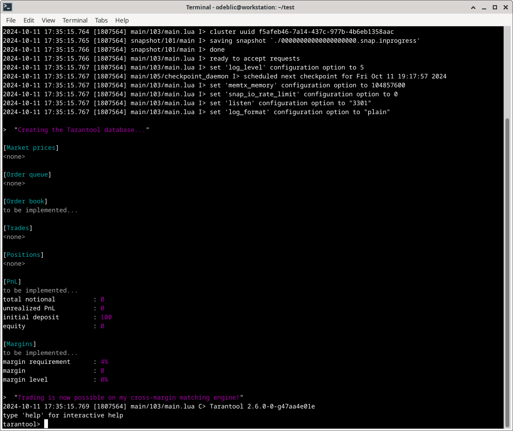
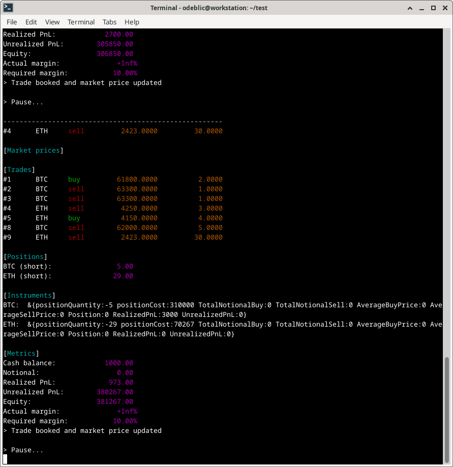
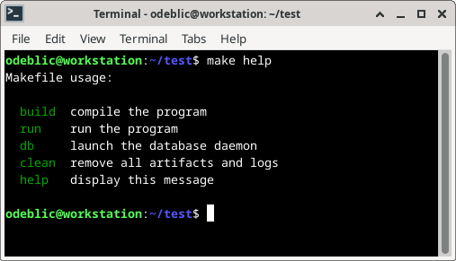

# Orderbook Matching with Cross-Margin

---

## Foreword

+ I have zero experience with **Go**.
+ I never heard about **Tarantool** before.
+ I am not familiar with **crypto** trading.
+ I was not aware of the **cross-margin** concept.

Screw that, I like challenges!

---

## Disclaimer

Note that specifications are extremely shallow, leaving a lot of room for interpretation.
In this context, I have decided not to push hard on robustness, performance, and even correctness.
The reason being it is pointless to fix and optimize a program for which the target is not clear.
I provide here the skeleton of a project with partially implemented features.

The matching logic is stupid-simple as it was not clear who is sending orders.

I suspect bugs in the calculation of PnL and margins...

A live discussion would allow to drive the design and coding in the expected direction.

To be continued...

---

## Implemented features

#### On startup

1. Some orders are initially queued.
2. Market prices for BTC and ETH are set.
3. Optionally, some trades are pre-booked.

#### In the event loop

1. Orders are dequeued one by one.
2. Each order is executed at its limit price.
3. The trade is then booked.
4. New metrics are calculated (PnL, margins, etc.)
5. If the margin is below the requirement, the trade is cancelled.
6. If not, the market price for the given symbol is updated.

(Enjoy the unique opportunity of risk-free market manipulation...)

---

## Project layout

```
.
|-- orderbook
|   |-- console.go
|   |-- database.go
|   |-- go.mod
|   |-- go.sum
|   |-- main.go
|   |-- matching_engine.go
|   `-- utils.go
|-- screenshots
|   |-- makefile.png
|   |-- orderbook.png
|   `-- tarantool.png
|-- tarantool
|   |-- main.lua
|   |-- margins.lua
|   |-- market_prices.lua
|   |-- order_book.lua
|   |-- order_queue.lua
|   |-- pnl.lua
|   |-- positions.lua
|   |-- report.lua
|   `-- trades.lua
|-- LICENSE.txt
|-- Makefile
|-- Notes.txt
`-- README.md
```

---

## Technical overview

The program is written in Go, with data persisted in a Tarantool database.
Several Lua scripts are provided to serve as a bridge with Go and for debug purpose.
A Makefile is provided to conduct the demo.

---

## Database schema

#### Market prices

+ ETH price in USD
+ BTC price in USD

#### Orders queue

|Id|Symbol|Direction|Price|Quantity|
|--|--|--|--|--|
|1|ETH|buy|2420.00|3.5|
|2|ETH|sell|2428.00|3.5|
|3|BTC|sell|62200.00|0.5|
|4|BTC|buy|62145.00|0.3|
|5|BTC|buy|62130.00|0.2|

#### Order book

Received orders processed by the matching engine.

Not implemented as the source of orders is not specified.

#### Trade record

All the trades booked during the session.

|Id|Symbol|Direction|Price|Quantity|
|--|--|--|--|--|
|1|ETH|buy|2420.00|3.5|
|2|ETH|sell|2428.00|3.5|
|3|BTC|sell|62200.00|0.5|
|4|BTC|buy|62145.00|0.3|
|5|BTC|buy|62130.00|0.2|

#### Trade record

Other metrics are dynamically calculated.

+ Pnl
+ positions
+ notional
+ equity
+ cash balance

---

## Usage

You need to open two terminals.
One for **Tarantool** and one for the **Order book**.

In the first terminal, launch the database:

```sh
make clean db
```

You may use the Lua helper funtions.

```sh
# check account details
status()
# send an order
order_queue.push('BTC', 'buy', 62000.00, 5)
# see market prices
market_prices.list()
# etc.
```

In the second terminal, execute the program:

```sh
make run
```

Also, consult the embedded help:

```sh
make help
```

---

## Screenshots

Tarantool after launch:



Order book running:



Makefile help:



---

## License

All the content of this repository is under AGPL license.

Please check carefully the terms in the `LICENSE.txt` file.

---

## Author

For any question, please contact the author: [Olivier de BLIC](mailto:odeblic@gmail.com).
